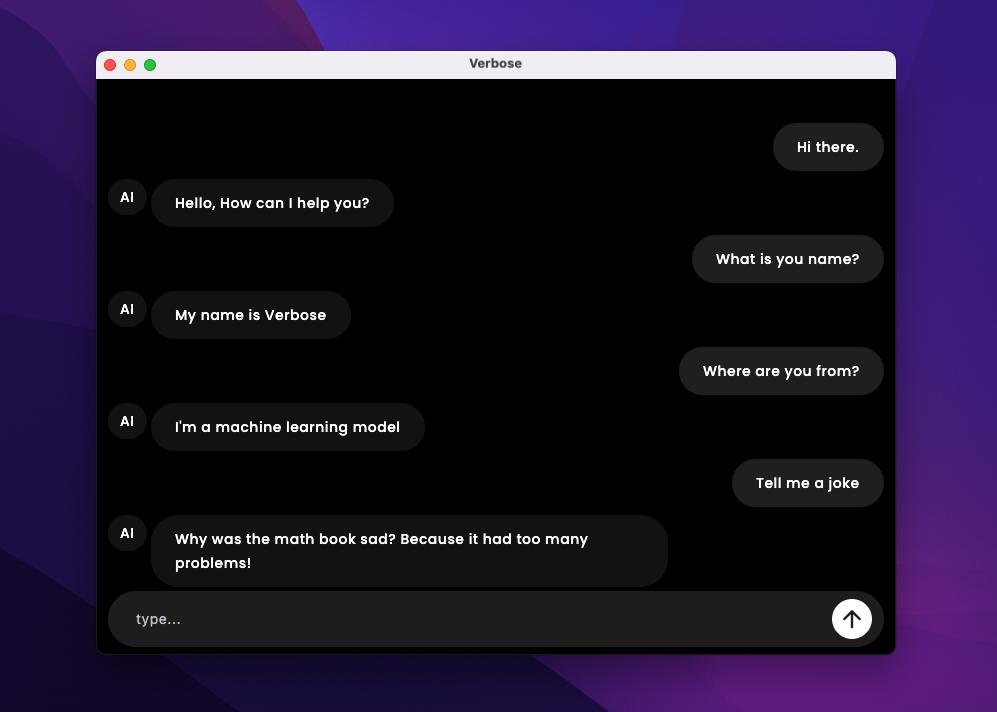

# 🤖 Verbose - AI Chat Application

<div align="center">


**A beautiful, cross-platform AI chat application built with Kotlin Multiplatform and Compose Multiplatform, powered by local LLMs through Ollama.**

[Features](#-features) • [Screenshots](#-screenshots) • [Setup](#-setup) • [Usage](#-usage) • [Architecture](#-architecture) • [Contributing](#-contributing)

</div>

---

## ✨ Features

- 🚀 **Cross-Platform**: Runs on Android and Desktop (JVM)
- 🤖 **Local AI**: Powered by local LLMs through Ollama - no cloud dependencies
- 💬 **Real-time Chat**: Beautiful chat interface with streaming responses
- 🎨 **Modern UI**: Material Design 3 with smooth animations
- 📱 **Responsive**: Adapts to different screen sizes and orientations
- 🔒 **Privacy-First**: All AI processing happens locally on your device
- ⚡ **Fast**: Built with Kotlin Multiplatform for optimal performance
- 🎭 **Animated**: Smooth animations for clipboard interactions and chat transitions

## 📱 Screenshots

<div align="center">
  
</div>

## 🛠️ Setup

### Prerequisites

- **Android**: Android Studio Hedgehog or later, API 24+
- **Desktop**: JDK 11 or later
- **Ollama**: Latest version installed on your system

### 1. Clone the Repository

```bash
git clone https://github.com/hossein-no1/verbose.git
cd verbose
```

### 2. Install Ollama

#### **macOS & Linux**
```bash
curl -fsSL https://ollama.ai/install.sh | sh
```

#### **Windows**
1. Download from [Ollama.ai](https://ollama.ai/download)
2. Run the installer and follow the setup wizard

#### **Verify Installation**
```bash
ollama --version
```

### 3. Download AI Models

#### **Recommended Models**

**For Fast Responses (Smaller Models):**
```bash
# Qwen 2.5 0.5B - Fast, lightweight
ollama pull qwen2.5:0.5b

# Llama 3.2 3B - Good balance of speed and quality
ollama pull llama3.2:3b
```

**For Better Quality (Larger Models):**
```bash
# Qwen 2.5 7B - Better quality, moderate speed
ollama pull qwen2.5:7b

# Llama 3.2 8B - High quality, slower
ollama pull llama3.2:8b
```

#### **Start Ollama Service**
```bash
ollama serve
```

**Keep this running in the background!**

### 4. Configure the Project

#### **Update Model Configuration**

Open `composeApp/src/commonMain/kotlin/com/ai/verbose/ui/chat/ChatViewModel.kt` and update the model:

```kotlin
// Change this line to use your preferred model
private val llmModel = OllamaModels.Alibaba.QWEN_2_5_05B

// Available options:
// OllamaModels.Alibaba.QWEN_2_5_05B    // qwen2.5:0.5b
// OllamaModels.Alibaba.QWEN_2_5_7B     // qwen2.5:7b
// OllamaModels.Meta.LLAMA_3_2_3B       // llama3.2:3b
// OllamaModels.Meta.LLAMA_3_2_8B       // llama3.2:8b
```

### 5. Build and Run

#### **Android**
```bash
./gradlew :composeApp:assembleDebug
# Open in Android Studio and run on device/emulator
```

#### **Desktop (JVM)**
```bash
./gradlew :composeApp:run
```


## 🚀 Usage

### Starting the Application

1. **Ensure Ollama is running:**
   ```bash
   ollama serve
   ```

2. **Verify your model is available:**
   ```bash
   ollama list
   ```

3. **Launch the app** on your preferred platform

### Chat Interface

- **Type your message** in the input field at the bottom
- **Press Enter or tap Send** to submit
- **Watch the AI respond** in real-time with streaming
- **Tap on any message** to reveal the clipboard button
- **Copy text** by tapping the clipboard icon

### Customization

#### **Change AI Personality**
Edit the system prompt in `ChatViewModel.kt`:

```kotlin
private val prompt = "You are a helpful AI assistant. Keep your responses concise and friendly. Your name is Verbose and you are from the Kotlin World. Be funny and cool."
```

#### **Adjust Response Length**
Modify the prompt to control response length:

```kotlin
private val prompt = "You are a concise AI assistant. Keep responses under 100 words and be direct."
```

## 🏗️ Architecture

```
composeApp/
├── src/
│   ├── commonMain/          # Shared code for all platforms
│   │   ├── kotlin/
│   │   │   ├── ui/         # Compose UI components
│   │   │   ├── core/       # Core functionality and DI
│   │   │   └── data/       # Data models and repositories
│   │   └── resources/      # Shared resources
│   ├── androidMain/         # Android-specific code
│   └── jvmMain/            # Desktop-specific code
├── build.gradle.kts         # Build configuration
└── gradle/                  # Gradle wrapper and dependencies
```

### **Key Technologies**

- **Kotlin Multiplatform**: Cross-platform development
- **Compose Multiplatform**: Modern declarative UI
- **Koog Agents**: AI/LLM integration framework
- **Koin**: Dependency injection
- **Material Design 3**: Modern UI components

### **Dependencies**

- **AI Framework**: Koog Agents with Ollama integration
- **UI**: Compose Multiplatform with Material 3
- **DI**: Koin for dependency injection
- **Networking**: Ktor client for HTTP communication

## 🔧 Troubleshooting

### **Common Issues**

#### **Ollama Connection Failed**
```bash
# Check if Ollama is running
ollama list

# Restart Ollama service
ollama serve
```

#### **Model Not Found**
```bash
# List available models
ollama list

# Pull the required model
ollama pull qwen2.5:0.5b
```

#### **Build Errors**
```bash
# Clean and rebuild
./gradlew clean
./gradlew build
```


### **Performance Tips**

- **Use smaller models** (0.5B-3B) for faster responses
- **Keep Ollama running** in the background
- **Close other resource-intensive applications** when running large models

## 🤝 Contributing

We welcome contributions! Here's how you can help:

### **Getting Started**

1. Fork the repository
2. Create a feature branch: `git checkout -b feature/amazing-feature`
3. Make your changes
4. Commit: `git commit -m 'Add amazing feature'`
5. Push: `git push origin feature/amazing-feature`
6. Open a Pull Request

### **Areas for Contribution**

- 🎨 **UI/UX Improvements**: Better animations, themes, layouts
- 🚀 **Performance**: Optimize AI responses, reduce memory usage
- 📱 **Platform Support**: Enhance Android/Desktop specific features
- 🧪 **Testing**: Add unit tests, integration tests
- 📚 **Documentation**: Improve guides, add examples
- 🌍 **Localization**: Add support for more languages

### **Code Style**

- Follow Kotlin coding conventions
- Use meaningful variable and function names
- Add comments for complex logic
- Include unit tests for new features

## 📄 License

This project is licensed under the MIT License - see the [LICENSE](LICENSE) file for details.

## 🙏 Acknowledgments

- **Ollama Team** for the amazing local LLM framework
- **JetBrains** for Kotlin Multiplatform and Compose
- **Koog Team** for the AI integration framework
- **Material Design Team** for the beautiful design system

## 📞 Support

- **Issues**: [GitHub Issues](https://github.com/hossein-no1/verbose-ai/issues)
- **Discussions**: [GitHub Discussions](https://github.com/hossein-no1/verbose-ai/discussions)
- **Wiki**: [Project Wiki](https://github.com/hossein-no1/verbose-ai/wiki)

---

<div align="center">

[Star on GitHub](https://github.com/hossein-no1/verbose-ai) • [Report Bug](https://github.com/hossein-no1/verbose-ai/issues) • [Request Feature]([https://github.com/yourusername/verbose](https://github.com/hossein-no1/verbose-ai)/issues)

</div>
